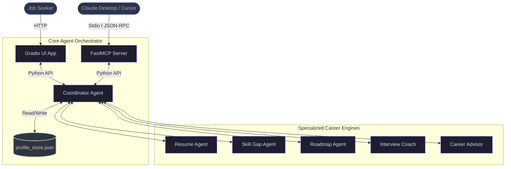
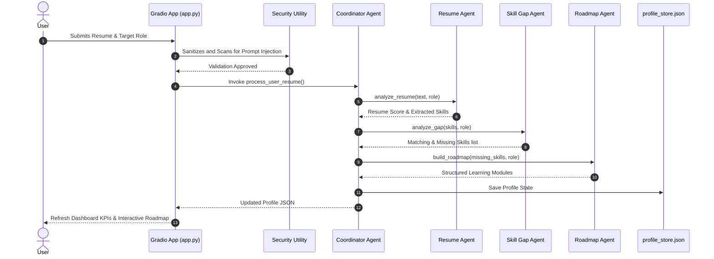

# CareerPilot AI — System Architecture

This document describes the design, data-flow models, security constructs, and component specifications of the **CareerPilot AI** multi-agent system.

---

## 🗺️ System Topology

CareerPilot AI uses a hub-and-spoke agent coordination architecture. The **Coordinator Agent** acts as the central router, maintaining state and delegating specific requests to specialized sub-agents. State is persisted locally via `profile_store.json` to allow session preservation across restarts.



---

## 🔄 Core Workflows

### 1. Resume Review and Learning Roadmap Generation

When a user submits a resume:
1. **Sanitization & Inspection**: The input text is run through `utils/security.py` to assert it is under 35,000 characters and free from prompt injection signatures.
2. **Resume Audit**: The **Resume Agent** scans the structure (detecting sections like Contact, Experience, Projects, Education) and extracts existing skills. It returns a formatting score out of 100 and checklists of strengths and recommendations.
3. **Gap Detection**: The **Skill Gap Agent** compares the extracted skills against standard requirements of the selected role. It lists matching competencies and missing skills.
4. **Plan Generation**: The **Roadmap Agent** loops through each missing skill and creates custom learning modules.
5. **State Persist**: The **Coordinator** updates the local JSON file. The Gradio dashboard reloads to display updated metrics, radar logs, and an interactive checklist of milestones.



### 2. Stateful Mock Interview Coaching

The Mock Interview operates as a turn-based loop:
1. The user starts the interview, prompting the **Coordinator** to query the **Interview Agent** for role-specific questions.
2. The coach asks the first question.
3. The user inputs their reply.
4. The **Coordinator** submits the reply to the **Interview Agent** for offline scoring based on length, STAR structure, and technical terminology.
5. The scorecard and feedback are appended to the chatbot history and persistent logs.
6. The next question is served. This continues until the question queue is exhausted.

---

## 🔒 Security Architecture & Trust Boundaries

To qualify as production-grade software, CareerPilot AI implements defensive filters at its inputs:

```
[User Input String] 
       │
       ▼
┌──────────────┐
│  Size Check  │ ──(Exceeds Limit)──► [Rejection Message]
└──────────────┘
       │
       ▼
┌──────────────┐
│  Injection   │ ──(Malicious Pattern matched)──► [Rejection Message]
│   Scanner    │
└──────────────┘
       │
       ▼
┌──────────────┐
│ Agent Engine │
└──────────────┘
       │
       ▼
┌──────────────┐
│  XSS Output  │ ──(Stripped Script/HTML tags)──► [Safe Rendered Output]
│  Sanitizer   │
└──────────────┘
```

1. **Input Limit Check**: Large payloads are blocked before execution to prevent memory depletion (Denial of Service). Text size is capped at 35,000 characters for resumes and 8,000 characters for conversational chat.
2. **System Instruction Defenses**: Regular expressions audit inputs for common override phrases (e.g., `ignore previous instructions`, `system override`, `dan mode`) to block prompt hijacking.
3. **Cross-Site Scripting (XSS) Sanitization**: Output strings are neutralized. Inline event handlers (like `onload=`) and script tags (`<script>`) are parsed out or modified (e.g., `blocked_event=`) before display in Gradio HTML widgets.

---

## 📁 Component Specifications

- **Gradio Dashboard UI (`app.py`)**: Renders the glassmorphic GUI. Hooks form actions to agent tasks and exposes custom tab panels.
- **FastMCP Server (`mcp_server.py`)**: Exposes agent capabilities as MCP tools, facilitating integration into development environments like Cursor, Claude Desktop, or VSCode.
- **Memory Manager (`utils/memory.py`)**: Standardizes serialization to disk, maintaining state persistence across application lifecycle sessions.
